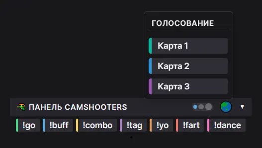
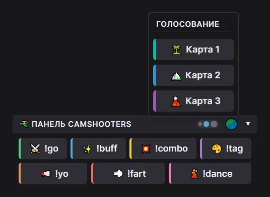
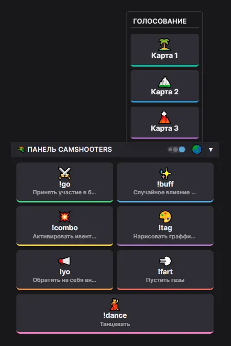

# 🔫 Twitch CamShooters Controller

 

Пользовательский скрипт для удобного управления в интерактивной игре [**CamShooters**](https://t.me/TDMzone/1448) (от стримера и независимого разработчика видеоигр [**Camelot63RU**](https://www.twitch.tv/camelot63ru)).

Скрипт добавляет панель с кнопками команд над полем ввода чата Twitch, убирает необходимость ручного ввода основных команд, увеличивает скорость реакции и помогает избежать опечаток.

## 📸 Скриншот

Компактная панель CamShooters (S)

Средняя панель CamShooters (M)

Большая панель CamShooters (L)

## ✨ Особенности

*   **Три размера кнопок**: Переключайте вид панели между компактным (S), средним (M) и крупным (L) режимами с помощью переключателя рядом с глобусом. Выбор сохраняется между сессиями.
*   **Компактный дизайн**: В режиме S панель занимает минимум места и идеально вписывается в тему Twitch.
*   **Иконки и подсказки**: В режимах M и L кнопки дополнены эмодзи-иконками. При наведении на любую кнопку появляется описание действия.
*   **Сворачиваемость**: Панель можно свернуть одним кликом по заголовку, скрипт запоминает состояние.
*   **Цветовая кодировка**: Каждая команда имеет свой цветовой акцент для быстрого визуального поиска.
*   **Голосование за карту**: Кнопки для выбора карты доступны при наведении на иконку глобуса 🌏 и также адаптируются под выбранный размер.

## 📥 Установка

1. Установите расширение менеджер скриптов для вашего браузера:
   *   **Chrome / Edge / Яндекс**: [Tampermonkey](https://www.tampermonkey.net/)
   *   **Firefox**: [Greasemonkey](https://addons.mozilla.org/ru/firefox/addon/greasemonkey/) или [Tampermonkey](https://addons.mozilla.org/ru/firefox/addon/tampermonkey/)
   *   **Safari**: [Userscripts](https://apps.apple.com/us/app/userscripts/id1463298887)

2. **[НАЖМИТЕ СЮДА, ЧТОБЫ УСТАНОВИТЬ СКРИПТ](https://raw.githubusercontent.com/HermanGuilliman/Twitch-CamShooters-Controller/main/Twitch_CamShooters_Controller.user.js)**

3. Подтвердите установку в открывшемся окне.

4. Обновите страницу Twitch.

## 🎛️ Переключатель размера кнопок

Рядом с иконкой глобуса 🌏 в заголовке панели расположен переключатель из трёх точек. Клик по нему циклически меняет размер кнопок:

| Режим | Точка | Описание |
| :--- | :---: | :--- |
| **Compact (S)** | 🔹 | Минималистичные кнопки — только текст команды, цветная левая полоса |
| **Normal (M)** | 🔷 | Средние кнопки — добавлены эмодзи-иконки, увеличен размер шрифта и отступы |
| **Large (L)** | ⬛ | Крупные карточки — иконка сверху, команда и подсказка под ней, цветная нижняя полоса, пульсация при наведении |

Выбранный размер сохраняется в `localStorage` и применяется ко всем кнопкам, включая кнопки голосования за карту.

## 🕹️ Список команд

| Кнопка | Иконка | Цвет | Действие в игре |
| :--- | :---: | :--- | :--- |
| **!go** | ⚔️ | Зелёный | Принять участие в битве |
| **!buff** | ✨ | Синий | Случайное влияние на персонажа |
| **!combo** | 💥 | Золотой | Активировать ивент (нужно 3 килла) |
| **!tag** | 🎨 | Фиолетовый | Нарисовать граффити под ногами |
| **!yo** | 📢 | Оранжевый | Обратить на себя внимание противников |
| **!fart** | 💨 | Красный | Пустить газы |
| **!dance** | 💃 | Розовый | Танцевать |

### 🌏 Голосование за карту

Кнопки для голосования за следующую карту доступны при наведении мыши на иконку глобуса 🌏 в заголовке панели.

| Кнопка | Иконка | Цвет | Действие в игре |
| :--- | :---: | :--- | :--- |
| **!map 1** | 🏝️ | Изумрудный | Проголосовать за первую карту |
| **!map 2** | 🏔️ | Голубой | Проголосовать за вторую карту |
| **!map 3** | 🌋 | Фиолетовый | Проголосовать за третью карту |

## 🛠️ Разработка

*   **Автор:** Herman Guilliman
*   **Email:** [hermanguilliman@proton.me](mailto:hermanguilliman@proton.me)
*   **Версия:** 0.9

## 🤝 Благодарности

Скрипт создан для сообщества и поддержки игры **CamShooters** от [**Camelot63RU**](https://www.twitch.tv/camelot63ru).